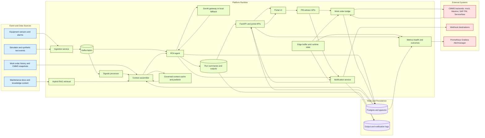
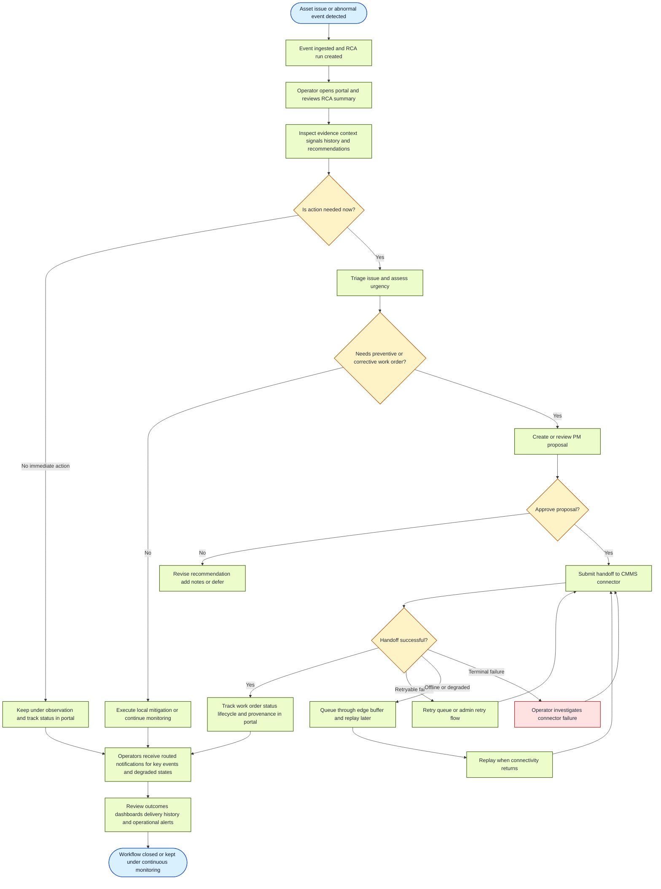
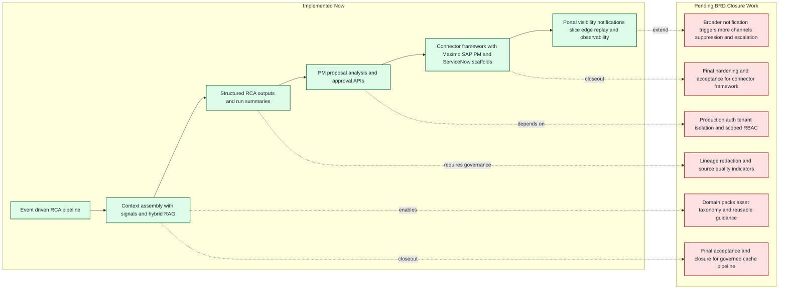
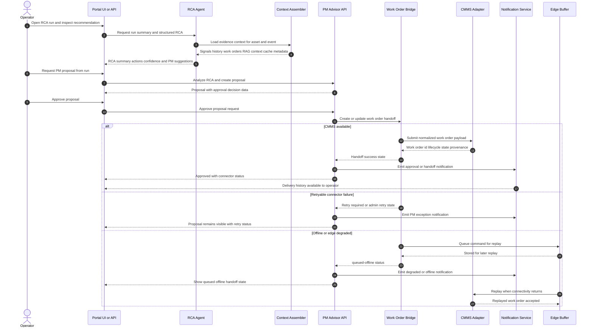

# Architecture and User Workflow Diagrams

This document captures the current Maintenance Intelligence operating model in two views:

- a technical architecture workflow showing how data and control move through the platform
- a user workflow showing how operators and maintenance teams interact with the system end to end

These diagrams reflect the implemented core plus the currently active notification-routing slice described in the BRD progress notes.

Deck-ready exports are generated under [docs/diagrams/export](docs/diagrams/export) from the Mermaid sources in [docs/diagrams/src](docs/diagrams/src).

## Executive Summary View

Deck-ready assets:

- SVG: [docs/diagrams/export/executive-summary.svg](docs/diagrams/export/executive-summary.svg)
- PNG: [docs/diagrams/export/executive-summary.png](docs/diagrams/export/executive-summary.png)

```mermaid
flowchart LR
    Event[Operational event or asset anomaly] --> Intelligence[Maintenance Intelligence platform]
    Intelligence --> RCA[Structured RCA and evidence review]
    RCA --> Decision[Operator triage and maintenance decision]
    Decision --> PM[PM proposal and approval]
    PM --> CMMS[CMMS handoff and lifecycle tracking]
    CMMS --> Notify[Notifications analytics and monitoring]

    classDef intake fill:#d8f0ff,stroke:#1d4ed8,color:#0f172a,stroke-width:1.5px;
    classDef platform fill:#ecfccb,stroke:#3f6212,color:#1f2937,stroke-width:1.5px;
    classDef decision fill:#fef3c7,stroke:#b45309,color:#1f2937,stroke-width:1.5px;
    classDef downstream fill:#fee2e2,stroke:#b91c1c,color:#1f2937,stroke-width:1.5px;

    class Event intake;
    class Intelligence,RCA platform;
    class Decision,PM decision;
    class CMMS,Notify downstream;
```

## Architecture Tech Workflow

Deck-ready assets:

- SVG: [docs/diagrams/export/architecture-workflow.svg](docs/diagrams/export/architecture-workflow.svg)
- PNG: [docs/diagrams/export/architecture-workflow.png](docs/diagrams/export/architecture-workflow.png)

## User Workflow

Deck-ready assets:

- SVG: [docs/diagrams/export/user-workflow.svg](docs/diagrams/export/user-workflow.svg)
- PNG: [docs/diagrams/export/user-workflow.png](docs/diagrams/export/user-workflow.png)

## BRD Future-State View

This view separates the capabilities that are already delivered from the remaining BRD closeout work.

Deck-ready assets:

- SVG: [docs/diagrams/export/brd-future-state.svg](docs/diagrams/export/brd-future-state.svg)
- PNG: [docs/diagrams/export/brd-future-state.png](docs/diagrams/export/brd-future-state.png)

## RCA to PM to CMMS Sequence

This sequence shows the operator-driven approval path, including success, retry, and offline replay outcomes.

Deck-ready assets:

- SVG: [docs/diagrams/export/rca-pm-cmms-sequence.svg](docs/diagrams/export/rca-pm-cmms-sequence.svg)
- PNG: [docs/diagrams/export/rca-pm-cmms-sequence.png](docs/diagrams/export/rca-pm-cmms-sequence.png)

## Reading Notes

- The architecture diagram emphasizes the implemented runtime: ingestion, Kafka-driven RCA, context assembly, PM handoff, notifications, edge buffering, and observability.
- The user workflow centers on the operator and maintenance decision path rather than internal service boundaries.
- The executive view is simplified for BRD reviews, steering updates, and stakeholder discussions that do not need service-level detail.
- The future-state view separates implemented platform depth from the remaining BRD closure items.
- The sequence diagram focuses on the approval-to-handoff path because it is the most operationally sensitive workflow in the current system.
- Notification routing is shown as part of the workflow because the current BRD update treats it as active progress rather than a purely future capability.
- Security hardening, broader auth integration, lineage, redaction, and domain packs remain BRD follow-up items and are not shown as closed capabilities.