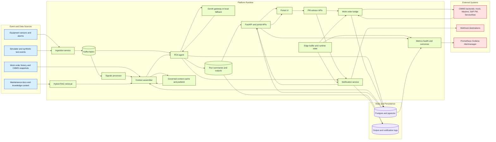
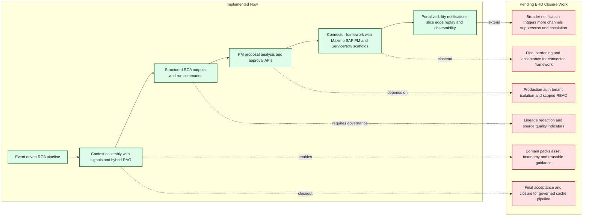
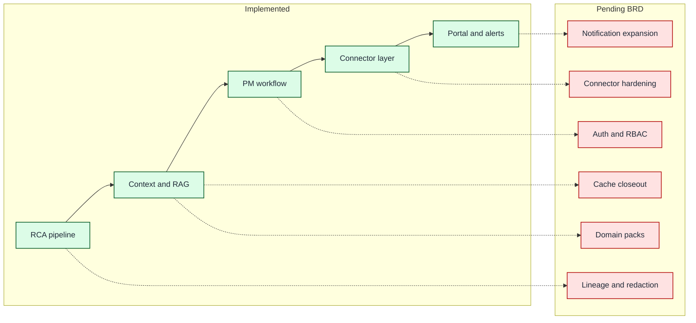
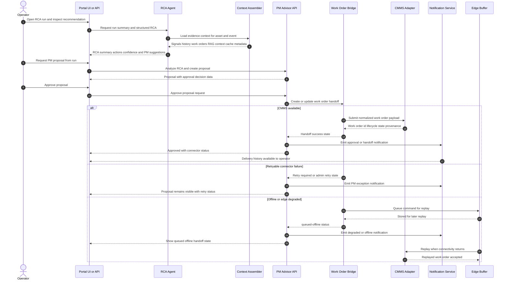
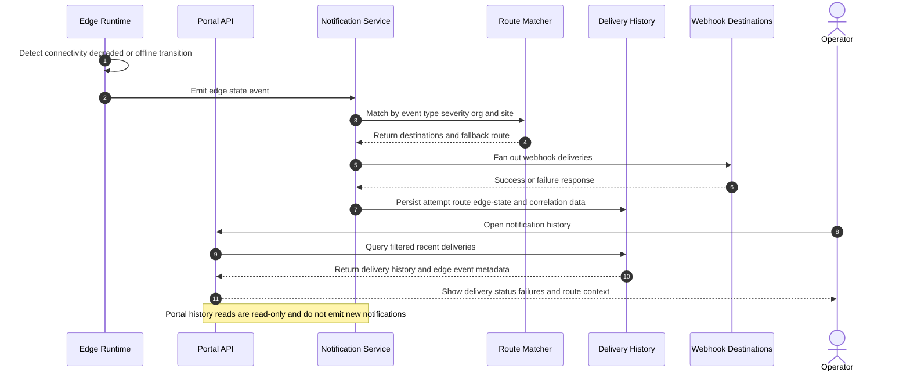

# Architecture and User Workflow Diagrams

This document captures the current Maintenance Intelligence operating model in two views:

- a technical architecture workflow showing how data and control move through the platform
- a user workflow showing how operators and maintenance teams interact with the system end to end

These diagrams reflect the implemented core plus the currently active notification-routing slice described in the BRD progress notes.

Deck-ready exports are generated under [docs/diagrams/export](docs/diagrams/export) from the Mermaid sources in [docs/diagrams/src](docs/diagrams/src).

## How to Regenerate Exports

Use the Mermaid source files in [docs/diagrams/src](docs/diagrams/src) and render them into [docs/diagrams/export](docs/diagrams/export).

Reliable local flow used in this workspace:

```bash
mkdir -p /tmp/mermaid-export
npm install --prefix /tmp/mermaid-export --no-package-lock @mermaid-js/mermaid-cli

for name in \
    executive-summary \
    executive-summary-short \
    architecture-workflow \
    user-workflow \
    brd-future-state \
    brd-future-state-short \
    rca-pm-cmms-sequence \
    notification-edge-sequence
do
    /tmp/mermaid-export/node_modules/.bin/mmdc \
        -i "docs/diagrams/src/${name}.mmd" \
        -o "docs/diagrams/export/${name}.svg" \
        -b white -t neutral -w 2200

    /tmp/mermaid-export/node_modules/.bin/mmdc \
        -i "docs/diagrams/src/${name}.mmd" \
        -o "docs/diagrams/export/${name}.png" \
        -b white -t neutral -w 2200 -s 2
done
```

The white background and wider render width are chosen for slide and deck use.

## Diagram Index

| Diagram | Intended audience | Best asset to use |
| --- | --- | --- |
| Executive Summary View | Steering committee, leadership, stakeholder updates | [docs/diagrams/export/executive-summary.png](docs/diagrams/export/executive-summary.png) |
| Executive Summary View, Short Labels | Leadership slides, title-constrained decks, status reviews | [docs/diagrams/export/executive-summary-short.png](docs/diagrams/export/executive-summary-short.png) |
| Architecture Tech Workflow | Engineering, platform, integration, SRE | [docs/diagrams/export/architecture-workflow.svg](docs/diagrams/export/architecture-workflow.svg) |
| User Workflow | Operations, reliability teams, product, enablement | [docs/diagrams/export/user-workflow.png](docs/diagrams/export/user-workflow.png) |
| BRD Future-State View | Product and delivery planning, BRD closeout reviews | [docs/diagrams/export/brd-future-state.png](docs/diagrams/export/brd-future-state.png) |
| BRD Future-State View, Short Labels | Single-slide BRD status and roadmap checkpoints | [docs/diagrams/export/brd-future-state-short.png](docs/diagrams/export/brd-future-state-short.png) |
| RCA to PM to CMMS Sequence | API design reviews, workflow QA, connector discussions | [docs/diagrams/export/rca-pm-cmms-sequence.svg](docs/diagrams/export/rca-pm-cmms-sequence.svg) |
| Notification Routing and Edge Emission Sequence | Notification routing reviews, edge-runtime operations | [docs/diagrams/export/notification-edge-sequence.svg](docs/diagrams/export/notification-edge-sequence.svg) |

## Executive Summary View

Deck-ready assets:

- SVG: [docs/diagrams/export/executive-summary.svg](docs/diagrams/export/executive-summary.svg)
- PNG: [docs/diagrams/export/executive-summary.png](docs/diagrams/export/executive-summary.png)

```mermaid
flowchart LR
    Event[Operational event or asset anomaly] --> Intelligence[Maintenance Intelligence platform]
    Intelligence --> RCA[Structured RCA and evidence review]
    RCA --> Decision[Operator triage and maintenance decision]
    Decision --> PM[PM proposal and approval]
    PM --> CMMS[CMMS handoff and lifecycle tracking]
    CMMS --> Notify[Notifications analytics and monitoring]

    classDef intake fill:#d8f0ff,stroke:#1d4ed8,color:#0f172a,stroke-width:1.5px;
    classDef platform fill:#ecfccb,stroke:#3f6212,color:#1f2937,stroke-width:1.5px;
    classDef decision fill:#fef3c7,stroke:#b45309,color:#1f2937,stroke-width:1.5px;
    classDef downstream fill:#fee2e2,stroke:#b91c1c,color:#1f2937,stroke-width:1.5px;

    class Event intake;
    class Intelligence,RCA platform;
    class Decision,PM decision;
    class CMMS,Notify downstream;
```



Speaker notes for deck reuse:

- This slide gives the full workflow in one visual: event intake, intelligence, decision, execution, and operational feedback.
- Use this as an opening architecture slide before drilling into technical or user-flow specifics.
- Emphasize that the model is operational today, with BRD closeout work focused on hardening and governance.

## Executive Summary View, Short Labels

This variant uses shorter labels for slide titles and tighter deck layouts.

Deck-ready assets:

- SVG: [docs/diagrams/export/executive-summary-short.svg](docs/diagrams/export/executive-summary-short.svg)
- PNG: [docs/diagrams/export/executive-summary-short.png](docs/diagrams/export/executive-summary-short.png)

```mermaid
flowchart LR
    Event[Asset event] --> Platform[MI platform]
    Platform --> RCA[Structured RCA]
    RCA --> Decision[Operator decision]
    Decision --> PM[PM approval]
    PM --> CMMS[CMMS handoff]
    CMMS --> Ops[Ops alerts and analytics]

    classDef intake fill:#d8f0ff,stroke:#1d4ed8,color:#0f172a,stroke-width:1.5px;
    classDef platform fill:#ecfccb,stroke:#3f6212,color:#1f2937,stroke-width:1.5px;
    classDef decision fill:#fef3c7,stroke:#b45309,color:#1f2937,stroke-width:1.5px;
    classDef downstream fill:#fee2e2,stroke:#b91c1c,color:#1f2937,stroke-width:1.5px;

    class Event intake;
    class Platform,RCA platform;
    class Decision,PM decision;
    class CMMS,Ops downstream;
```



Speaker notes for deck reuse:

- This is the compressed executive storyline: detect, analyze, decide, approve, hand off, and monitor.
- Use this variant when slide space is limited or when the audience needs a fast status narrative.
- Pair with the short BRD future-state view to contrast what is live versus what remains.

## Architecture Tech Workflow

Deck-ready assets:

- SVG: [docs/diagrams/export/architecture-workflow.svg](docs/diagrams/export/architecture-workflow.svg)
- PNG: [docs/diagrams/export/architecture-workflow.png](docs/diagrams/export/architecture-workflow.png)



## User Workflow

Deck-ready assets:

- SVG: [docs/diagrams/export/user-workflow.svg](docs/diagrams/export/user-workflow.svg)
- PNG: [docs/diagrams/export/user-workflow.png](docs/diagrams/export/user-workflow.png)


## BRD Future-State View

This view separates the capabilities that are already delivered from the remaining BRD closeout work.

Deck-ready assets:

- SVG: [docs/diagrams/export/brd-future-state.svg](docs/diagrams/export/brd-future-state.svg)
- PNG: [docs/diagrams/export/brd-future-state.png](docs/diagrams/export/brd-future-state.png)



## BRD Future-State View, Short Labels

This variant compresses the BRD labels for slide-heavy presentations.

Deck-ready assets:

- SVG: [docs/diagrams/export/brd-future-state-short.svg](docs/diagrams/export/brd-future-state-short.svg)
- PNG: [docs/diagrams/export/brd-future-state-short.png](docs/diagrams/export/brd-future-state-short.png)



One-slide summary note (implemented vs pending BRD):

- Implemented now: RCA pipeline, governed context and RAG foundations, PM workflow, connector framework baseline, and portal-plus-alert visibility.
- Pending BRD closeout: production auth and RBAC hardening, cache and connector acceptance closure, broader notification policy and channels, domain packs, and lineage-redaction controls.
- Suggested talk track: "Core workflow is production-shaped; remaining BRD work is concentrated in security, governance, and delivery hardening."

## RCA to PM to CMMS Sequence

This sequence shows the operator-driven approval path, including success, retry, and offline replay outcomes.

Deck-ready assets:

- SVG: [docs/diagrams/export/rca-pm-cmms-sequence.svg](docs/diagrams/export/rca-pm-cmms-sequence.svg)
- PNG: [docs/diagrams/export/rca-pm-cmms-sequence.png](docs/diagrams/export/rca-pm-cmms-sequence.png)



Speaker notes for deck reuse:

- This sequence is the core execution path from RCA review to approved CMMS handoff.
- Walk the audience through the three operational outcomes: success, retry-required, and queued-offline replay.
- Highlight that operator visibility remains continuous through portal status and notification history.

## Notification Routing and Edge Emission Sequence

This sequence focuses on edge degraded-state emission, route matching, delivery logging, and operator review.

Deck-ready assets:

- SVG: [docs/diagrams/export/notification-edge-sequence.svg](docs/diagrams/export/notification-edge-sequence.svg)
- PNG: [docs/diagrams/export/notification-edge-sequence.png](docs/diagrams/export/notification-edge-sequence.png)



Speaker notes for deck reuse:

- This sequence clarifies that notifications are emitted by runtime transitions, not by portal page loads.
- Emphasize route matching plus fan-out delivery as the mechanism for reliable org and site specific alerting.
- Use this slide to explain traceability: every attempt is persisted with route, edge-state, and correlation context.

## Reading Notes

- The architecture diagram emphasizes the implemented runtime: ingestion, Kafka-driven RCA, context assembly, PM handoff, notifications, edge buffering, and observability.
- The user workflow centers on the operator and maintenance decision path rather than internal service boundaries.
- The executive view is simplified for BRD reviews, steering updates, and stakeholder discussions that do not need service-level detail.
- The short-label variants are intended for slide titles, narrower deck columns, and screenshot-based summaries.
- The future-state view separates implemented platform depth from the remaining BRD closure items.
- The sequence diagram focuses on the approval-to-handoff path because it is the most operationally sensitive workflow in the current system.
- The notification sequence isolates the runtime edge-event emission path from the portal history read path, which matches the current notification-routing design.
- Notification routing is shown as part of the workflow because the current BRD update treats it as active progress rather than a purely future capability.
- Security hardening, broader auth integration, lineage, redaction, and domain packs remain BRD follow-up items and are not shown as closed capabilities.